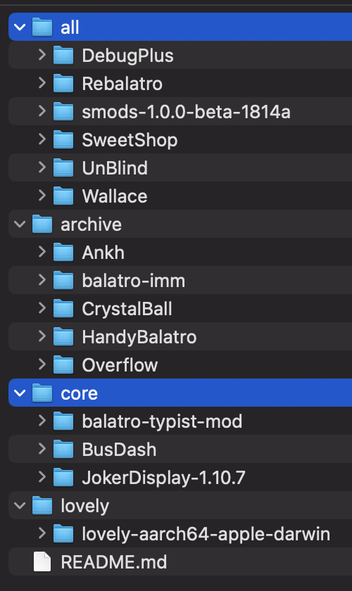

# balatro-runner

Run Balatro with a configurable set of mods.

## Why

You may want to switch up which mods you use. In-game, you can do this with steamodded's mod list, but what if you also want to load the game without smods sometimes? balatro-runner allows you to do this.

## Support

This script only works on macOS and requires python3. (It's tested on system python3 but any python3 should work.)

## Install

1. Edit the `MODS_SRC_PATH` to set it to a folder that will contain your mods, but wait before you move your mods.

2. This script expects your mods to be in two subfolders within `MODS_SRC_PATH`:

- `/core`: the subset of mods you want to always be running
- `/all`: all your other mods

Here is an example of what your mods setup could look like. (Extra subfolders like `lovely` or `archive` are currently ignored.)

## Run

First, follow the install instructions. The runner will not work if it can't find your mods.

Then, you can choose between the following commands.

- `python3 run_balatro.py` runs the Steam client without any mods
- `python3 run_balatro.py core` (or `python3 run_balatro.py core -v` for verbose mode) runs the game with only the core mods
- `python3 run_balatro.py all` (or `python3 run_balatro.py all -v` for verbose mode) runs the game with all the mods, including the ones in `/core` and `/all`. You can use Steamodded's in-game mod list interface to decide which ones to toggle.

## Troubleshooting

Contact `Bus693` on Balatro Discord. Include the command output in verbose mode.